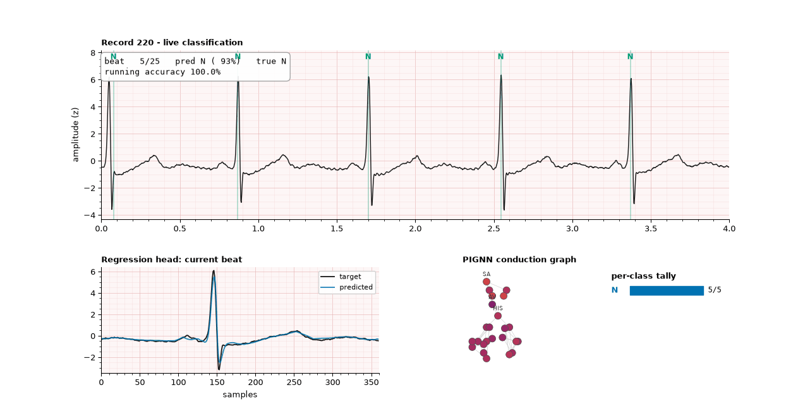
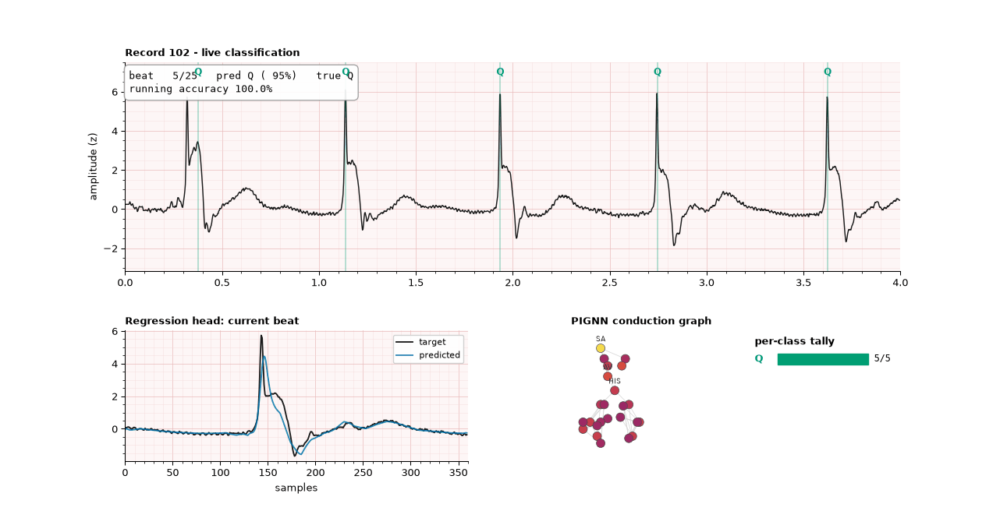

# heart-pignn

 

MIT-BIH beat classification into AAMI classes, where the **heuristic tree from
`main.py`** and the **PIGNN from `Modelo2.ipynb`** are joined through the latent
space of the attention module.

The pipeline is Modelo3's — beat windows, real cardiologist annotations,
resumable checkpoints, a historical test log — with the encoder swapped: instead
of a 1D CNN, the signal propagates over the cardiac conduction graph
(SA → AV → His-Purkinje → myocardium).

The model has **two outputs**: a **regression** layer that predicts the waveform
and a **classification** layer that predicts the pathology. Both hang off the
same PIGNN encoder.

---

## Architecture

```
              beat window  [B, 1, 360]
                        |
              SignalEncoder (conv1d x3, stride 2, pooled to S steps)
                        |
              PIGNNEncoder: GraphGRUCell x L over 24 conduction nodes
                        |  node_states [B, S, 24, H]  + vm + tension
                        |
          +-------------+-------------+
          |                           |
          v                           v
   CardiacAttentionBridge      DipoleSignalDecoder
   (collapses time)            (preserves time)
          |                           |
          +--> z  LATENT              +--> REGRESSION: signal [B, 360, 1]
          |     |
   RR ctx |     +--> auxiliary head: main.py's verdict
      |   |     +--> similarity to batch regime prototypes
   soft -+------+--> RuleFiLM(z, rules)
   tree              |
                     v
            CLASSIFICATION: AAMI (N, S, V, F, Q)
```

| Output | Reads | Predicts | Metrics |
|---|---|---|---|
| Regression | full `node_states` | waveform `[B, T, 1]` | RMSE, PRD, Pearson |
| Classification | `z` from attention | AAMI class | macro F1, per-class, confusion |

Regression deliberately does **not** read `z`: attention collapses time into a
single vector, and you cannot rebuild a waveform from a vector. Each head
hanging off a different thing is what splits the work — regression demands fine
temporal detail, classification demands a summarizable representation.
`recon_w` sets the balance; `--recon-w 0` is the ablation.

### Four ways main.py connects to the latent

| Connection | Mechanism | What it buys |
|---|---|---|
| PIGNN → `z` | node then time attention | weights say which cardiac region drove the beat |
| `z` → `main.py` | auxiliary head with BCE | forces `z` to encode rhythm, not just QRS shape |
| `main.py` → `z` | FiLM with the soft tree | rhythm context changes *how* morphology is read |
| batch → `z` | EMA prototypes per regime | each beat is compared to the summary training built |

FiLM rather than concatenation, because concatenating lets the network ignore
the rules by growing the norm of the rest of the vector.

### The tree, made differentiable

`main.py` decides with hard cuts (`HR < 60`, `CV > 15%`). A hard cut has zero
gradient everywhere. In `heuristics.py` each cut also appears as
`sigmoid((x - threshold) / tau)`. Same thresholds; only the transition width is
new. `hard_rules()` still produces the original textual report.

---

## Install

Needs [uv](https://docs.astral.sh/uv/). One script drives everything:

```bash
chmod +x run.sh
./run.sh            # organize files, install, verify on synthetic data
```

Then drop MIT-BIH at the repo root as `mit-bih-arrhythmia-database-1.0.0/`
(the folder containing `100.dat`, `100.hea`, `100.atr`, …) and:

```bash
./run.sh baseline       # run BEFORE training -- your reference point
./run.sh train 30
./run.sh evaluate
./run.sh visualize
./run.sh explain
./run.sh ablations
```

### GPU

`./run.sh gpu` reports whether torch can see a CUDA device. Training picks the
GPU automatically and enables mixed precision on it; `--device cpu` forces
otherwise. If you have an NVIDIA card but torch reports none, you have the CPU
wheel:

```bash
uv pip install torch --index-url https://download.pytorch.org/whl/cu124
```

DataLoader workers auto-detect: 0 on Windows (multiprocessing incompatibility),
a few elsewhere. Override with `--num-workers`.

---

## Augmentation

The imbalance is brutal: ~65k N beats against ~800 F. A balanced sampler fixes
the *ratio* but not the *variety* — it draws the same 800 F beats forty times an
epoch and the model memorizes them. That shows up as train F1 0.98 against val
F1 0.55, which is exactly what the first real run produced.

Augmentation attacks variety instead, and **shifting is the important one**: the
R peak sits at a fixed offset in every window, so a model can learn "the spike is
at sample 144" and lean on that instead of morphology. Jittering the crop centre
removes that crutch.

| Transform | Default | Applied to |
|---|---|---|
| R-peak crop shift | ±60 ms | whole window |
| Time warp | ±6% | whole window |
| Amplitude scale | 0.80–1.25 | whole window |
| Gaussian noise | σ=0.015 | input only |
| Baseline wander | σ=0.08, <0.6 Hz | input only |

Two rules the transforms follow. Geometric transforms apply to the whole
multi-channel window *before* it splits into input and target, so the two stay
physically consistent. Corrupting transforms apply to the input only — asking the
model to predict noise nobody can predict just teaches it to output the mean.

The shift is applied by moving the crop centre *into the record*, not by padding
or `np.roll`, so no zero-filled edges or wrapped tails are ever introduced.

Rare classes (S, V, F) get transforms at `minority_boost` × intensity, since they
are the ones the sampler repeats most.

---

## Imbalance is corrected once, not twice

Modelo3 applied a balanced sampler **and** capped class weights at the same time.
That double-corrects, and on MIT-BIH the symptom is unmistakable: class N with
precision 0.95 and recall 0.55, i.e. every minority class over-predicted.

`imbalance_strategy` now picks one mechanism. The default is `sampler` alone with
`sampler_alpha=0.5` (square-root balancing) rather than full balancing, because
at a 66:1 ratio full balancing means the same ~900 S beats get drawn thousands of
times per epoch.

```bash
./run.sh train 30                                  # sampler, alpha 0.5 (default)
uv run heart-pignn train --sampler-alpha 1.0       # fully balanced
uv run heart-pignn train --imbalance-strategy weights
uv run heart-pignn train --imbalance-strategy both # the old double-correcting behaviour
```

---

## Visualization

`./run.sh visualize` writes two files to `figures/`:

- **`<record>_realtime.gif`** replays a continuous strip like a bedside monitor.
  Each beat lights up as the model classifies it, a side panel shows the
  regression head against the true waveform, and a per-class tally builds up.
  This is where you see failure modes a confusion matrix hides — the model
  flipping between S and V on consecutive beats of identical morphology, say.
- **`<record>_summary.png`** is the static end state: the full strip with every
  beat marked, best/median/worst reconstructions, and that record's metrics.

Both run on beats the model never trained on, and the strip is real signal from
the record, so RR timing is genuine. Colours are Okabe-Ito, so correct-vs-wrong
stays readable for red-green colour blindness.

A single record illustrates behaviour; it is not a metric. Use the test numbers.

---

## Regression target

| Mode | What it predicts | Measured on MIT-BIH |
|---|---|---|
| `reconstruct` (default) | its own clean input window | PRD ~26%, r ~0.96 |
| `cross_lead` | channel 1 (V1/V5) from channel 0 | **collapses**: PRD ~101%, r ~0.02 |
| `none` | nothing | — |

`cross_lead` was the original default and it was the wrong call. Predicting V1
morphology from a single MLII beat with no record identity is close to
ill-posed, and MSE's optimum for an unpredictable target is the conditional
mean — a flat line, which is exactly what PRD ≈ 100% means. It stays available
for experiments.

Be careful reading `reconstruct` PRD too: an encoder with spare capacity rebuilds
its own input nearly perfectly, so a low number there is not the achievement it
looks like. It earns its place as a regularizer and as the thing that makes the
real-time visualization meaningful.

The signal loss reproduces Modelo2's: MSE + `1 − Pearson` + smoothness. The
Pearson term is not decoration — with MSE alone the model predicts the mean when
the signal gets hard and you get a flat line with a respectable error.

---

## Ablations

`./run.sh ablations` runs four, each in its own folder:

| Run | Change | Question |
|---|---|---|
| no rules | `--rule-w 0` | what connecting main.py to the latent buys |
| no regression | `--recon-w 0` | what the signal head buys classification |
| no augmentation | `--no-augment` | how much of the gain is augmentation |
| fully balanced | `--sampler-alpha 1.0` | whether square-root balancing was the right call |

The comparison that matters for a report is against `Modelo3.ipynb` at the same
seed and split. If the PIGNN does not beat the 1D CNN, that is publishable too.

---

## Limitations

- **R positions come from the `.atr` file**, as in Modelo3 and nearly all MIT-BIH
  literature. That assumes detection is solved. `DataConfig(rr_source="detected")`
  measures without the assumption, and the number drops.
- **Local RR features are strong on their own.** A premature beat gives itself
  away in timing before morphology. `use_local_rr=False` isolates the morphology
  contribution.
- **Classes F and Q can have under 30 test beats** depending on the split. Their
  F1 is sampling noise, and so is any macro average including them — the test
  report now warns when this happens.
- **Attention is an explanation, not a cause.** High weight on a node does not
  prove the model reasons about it.
- **One seed is not a result.** Run 3–5 and report mean and spread.
- The synthetic `demo-data` records measure nothing.

---

## Layout

```
src/heart_pignn/
|- aami.py         MIT-BIH -> AAMI mapping (shared with Modelo3)
|- heuristics.py   main.py's tree: hard and soft versions
|- graph.py        24-node conduction graph (from Modelo2)
|- pignn.py        signal encoder + vectorized GraphGRUCell
|- attention.py    the bridge: attention, FiLM, batch prototypes
|- decoder.py      regression head: nodes -> waveform
|- model.py        full wiring -> both output heads
|- augment.py      shift, warp, amplitude, noise, baseline wander
|- data.py         MIT-BIH beat dataset with RR context
|- losses.py       masked signal + weighted CE + rule BCE + physics
|- train.py        loops, GPU/AMP, tqdm, checkpoints, test log
|- explain.py      per-class node importance
|- visualize.py    real-time ECG monitor + summary figure
|- demo_data.py    synthetic WFDB generator
|- cli.py          Typer CLI
tests/             unit tests + end-to-end on synthetic data
notebooks/         Modelo4_PIGNN_Attention.ipynb
run.sh             single entry point for everything
```

---

## Data and citation

MIT-BIH Arrhythmia Database (v1.0.0), PhysioNet, ODC-BY 1.0. Not bundled here.

```
Goldberger, A., Amaral, L., Glass, L., Hausdorff, J., Ivanov, P. C., Mark, R.,
... & Stanley, H. E. (2000). PhysioBank, PhysioToolkit, and PhysioNet:
Components of a new research resource for complex physiologic signals.
Circulation [Online]. 101 (23), pp. e215-e220. RRID:SCR_007345.
```

Class standard: AAMI EC57.
